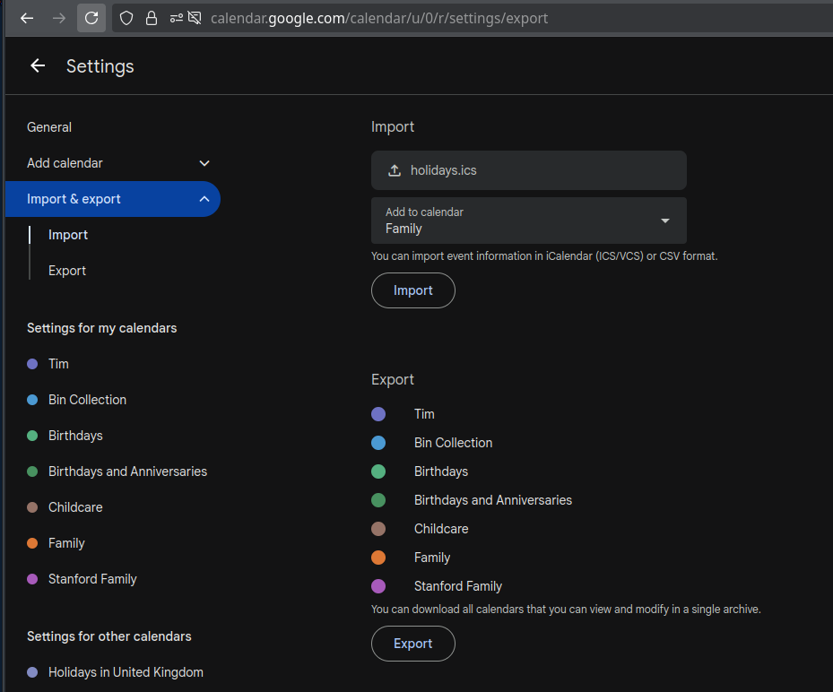

# Web Scraping

This repository contains various web scraping utilities that I have created that extract data from the web and process it into output data files

## Installation
```
python -m venv .
. ./bin/activate 
pip install -r requirements.txt
```

## scrapeFifeSchoolHolidays.py

This will extract data from Fife Council's web site and will output a list of the published school holidays. The output can either by in `ical` or `csv` format. The output will be written to the console so just redirect this to your output file.

### Output CSV file
```
python scrapeFifeSchoolHolidays.py --csv > holidays.csv
```

## Output ICal file
```
python scrapeFifeSchoolHolidays.py --ical > holidays.ics
```

## Importing ICal file into google calendar

First of all, generate the ICal file locally, or download the [holidays.ics](./holidays.ics) file 

Then import the ICal file within the settings of Google Calendar. See screenshot below for details.

 
  
